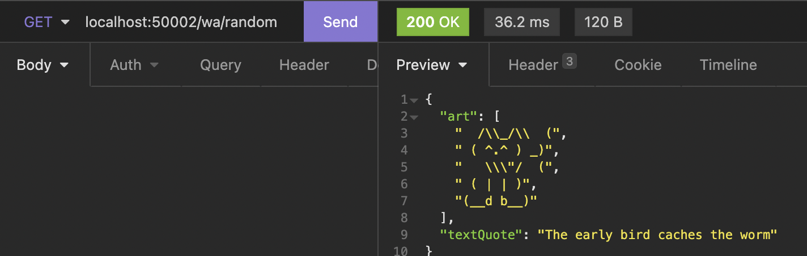
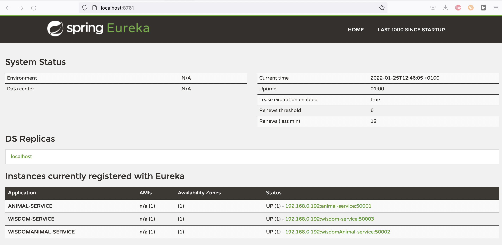
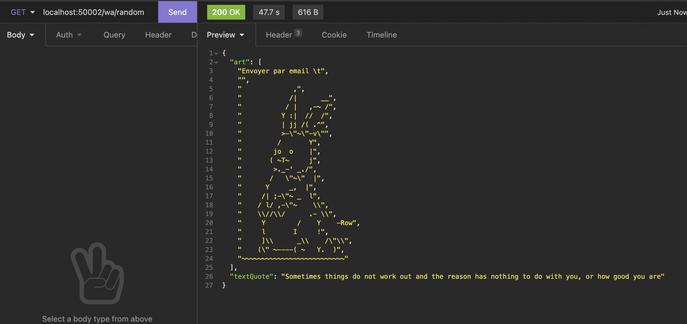
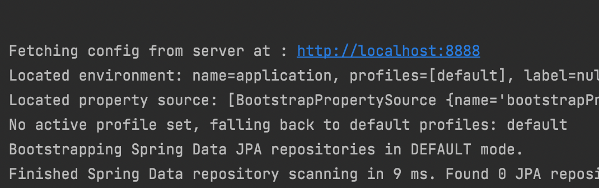

# Wisdom Animals
by Matthias Holzer

(asci art from https://mkyong.com/java/ascii-art-java-example/ and https://www.asciiart.eu/animals)

## A microservice spring boot application
* feature/s1-f2_multimodule_build
* feature/s1-f3_introducing_feign
* feature/s1-f4_service_registry
* feature/s1-f5_circuit_breaker
* feature/s1-f6_config_server

## Idea
Generating Calendar Quotes with a sweet ascii 
art animal from one microservice and one wisdom
quote from another microservice

## Microservices
* animal-service 
* quotes-service
* wisdomAnimal-service

## Eureka
Ports are all defined specific, for debug purpose. 
In production, they will all be set to 0, and handed 
out by eureka.

## circuit breaker fallback

## config server
